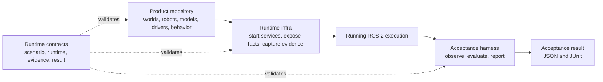

# Robotics Runtime Contracts

[](https://github.com/mmkolpakov/robotics-runtime-contracts/actions/workflows/ci.yml)
[](https://github.com/mmkolpakov/robotics-runtime-contracts/releases/latest)
[](LICENSE)

Define one machine-verifiable language for portable robotics executions.

Use this repository to:

1. **Declare** the requested scenario, workload, ROS graph, timing, safety, and
   evidence policy.
2. **Describe** the runtime, model, dataset, authorization, evidence, and final
   result with versioned JSON Schema contracts.
3. **Extend** domain data through digest-pinned schemas without weakening the
   common execution boundary.

The contracts are neutral to robot type, simulator scene, model family, and
product rules. Launch files, worlds, model weights, and control logic belong in
consumer repositories. This package validates documents; it does not start a
runtime, observe ROS, collect evidence, or decide a verdict.

## Where It Fits



The end-to-end handoff is machine-readable: a product repository supplies its
workload and scenario, runtime infra emits observed runtime and evidence facts,
and the harness emits an acceptance result plus JUnit. Each layer can evolve
and be tested independently.

[`robotics-runtime-infra`](https://github.com/mmkolpakov/robotics-runtime-infra)
uses these contracts to describe the environment and evidence.
[`robotics-acceptance-harness`](https://github.com/mmkolpakov/robotics-acceptance-harness)
uses the same contracts to validate inputs and emit a result.

## Choose an Interface

| Goal | Start here |
| --- | --- |
| Validate an application document | [`validate_document()`](#python-api) |
| Embed a published schema | [`load_schema()` or `schema_path()`](#python-api) |
| Review the public document set | [Schema Catalog](#schema-catalog) |
| Start a consumer integration | [`consumer-examples/`](consumer-examples/) |
| Add product-specific fields | [Domain Extensions](#domain-extensions) |
| Change a public contract | [Compatibility policy](COMPATIBILITY.md) and [Development](#development) |

## Install

The current package line is 0.8.0. Install its attested wheel directly from the
GitHub Release:

```bash
python -m pip install \
  https://github.com/mmkolpakov/robotics-runtime-contracts/releases/download/v0.8.0/robotics_runtime_contracts-0.8.0-py3-none-any.whl
```

Python 3.12 or newer is required. Release assets include the wheel and source
distribution. GitHub stores build-provenance attestations for both artifacts.

## Quick Start

Run a version-controlled fixture through the same structural, semantic, and
extension validation used by consumers. This example uses
[uv](https://docs.astral.sh/uv/) from a checkout:

```bash
git clone https://github.com/mmkolpakov/robotics-runtime-contracts.git
cd robotics-runtime-contracts
uv sync --locked --all-groups
uv run python - <<'PY'
import yaml
from pathlib import Path
from robotics_runtime_contracts import validate_document

path = Path("tests/fixtures/scenario/valid/simulation-realtime.yaml")
validate_document(yaml.safe_load(path.read_text(encoding="utf-8")))
print("valid")
PY
```

Expected output is `valid`. The fixture is intentionally loaded by the caller:
the package accepts parsed mappings and does not impose a JSON or YAML loading
policy on applications.

## Schema Catalog

| Schema version | Purpose |
| --- | --- |
| `acceptance-scenario.v1` | Execution intent, ROS readiness, timing, evidence, authorization, and forbidden interfaces |
| `acceptance-scenario.v2` | Attributed metrics and measured time-authority policy |
| `acceptance-run.v1` | Immutable run identity, scenario digest, time authority, and domain membership |
| `acceptance-result.v1` | Domain acceptance verdict and observed evidence |
| `acceptance-result.v2` | Run-scoped result with explicit domain, coverage, and time-authority evidence |
| `acceptance-result.v3` | Run-scoped result with verified streaming trace evidence |
| `acceptance-aggregate.v1` | Per-domain result aggregation with unevaluated cross-domain status |
| `acceptance-aggregate.v2` | Cross-domain channel and causal-chain verdict |
| `causal-chain.v1` | Ordered channel expectations for a cross-domain causal chain |
| `model-artifact-manifest.v1` | Model provenance, provider compatibility, and numerical conformance |
| `dataset-manifest.v1` | Immutable MCAP datasets, channels, time base, and governance |
| `runtime-manifest.v1` | Observed runtime, workload, accelerator, security, timing, and physical target facts |
| `execution-permit.v1` | Short-lived two-party physical execution permit bound to policy and target identity |
| `execution-verification.v1` | Verified Sigstore signers, target, and execution-policy decision |
| `evidence-index.v1` | Finalized local and confirmed remote evidence segments |
| `evidence-index.v2` | Evidence policy observation and MCAP summary references |
| `mcap-summary.v1` | Canonical MCAP statistics and channel summary |
| `qualification-bundle.v1` | In-toto-shaped qualification evidence statement |
| `qualification-policy.v1` | Trust policy for qualification-bundle verification |
| `zenoh-channel.v1` | Cross-domain channel contract |
| `zenoh-channel-observation.v1` | Observed cross-domain channel delivery and trace evidence |

Every schema uses JSON Schema Draft 2020-12, rejects unknown root fields, has a
versioned `$id`, and is included in the Python wheel.

## Python API

```python
from robotics_runtime_contracts import (
    ContractValidationError,
    SemanticValidationError,
    load_schema,
    schema_names,
    schema_path,
    validate_document,
)

print(schema_names())
validate_document(document)
schema = load_schema("runtime-manifest.v1")
```

`validate_document()` selects the contract from `schema_version`. Structural
and semantic failures include an exact JSON path. `validate_scenario()` and
`ScenarioValidationError` provide the scenario-specific validation path.

## Domain Extensions

`acceptance-scenario.v1` and `acceptance-scenario.v2` support independently
versioned, namespaced extension schemas without weakening common safety, time,
or evidence rules. The caller supplies the digest-pinned schema bytes;
validation never fetches a schema from the network. Migrating a scenario to v2
preserves the declarations and payload, and the migrated payload is validated
against the same pinned schema.

```python
validate_document(
    scenario,
    extension_schemas={
        "https://schemas.example.org/sorting.v1.schema.json": schema_bytes,
    },
)
```

Extension keys use reverse-domain namespaces such as `org.example.sorting`.
External `$ref` values are rejected to keep validation deterministic and free
from network or file-system side effects.

## Compatibility

[COMPATIBILITY.md](COMPATIBILITY.md) defines package SemVer, immutable published
schema bytes, exact reader and writer behavior, the migration policy for every
schema, and the normative ROS 2 Jazzy, Gazebo Harmonic, and zstd basis.

HIL and real-target contracts are observation-only and never authorize physical
actuation.

Package installation is not a hardware qualification. Accelerator, HIL, and
real-target claims are owned by the runtime infrastructure's
[support matrix](https://github.com/mmkolpakov/robotics-runtime-infra#support-status)
and are scoped to an exact source revision, image digest, and named device.

## Development

```bash
uv sync --locked --all-groups
uv run pre-commit run --all-files --show-diff-on-failure
uv run pytest
uv build
```

CI validates every schema against its metaschema, runs positive and negative
fixtures and neutral consumer examples, runs strict static analysis, builds
wheel and source distributions, and verifies the installed artifacts.

## Support and Security

Use [GitHub Issues](https://github.com/mmkolpakov/robotics-runtime-contracts/issues)
for reproducible contract defects and compatibility questions. See
[CONTRIBUTING.md](CONTRIBUTING.md) before proposing a schema change. Report
security-sensitive findings according to [SECURITY.md](SECURITY.md); never put
credentials, private datasets, device identifiers, or signing material in an
issue.

The package currently declares
[REP-2004 Quality Level 4](QUALITY_DECLARATION.md). Release components and their
factual SLSA Build level are listed in [SUPPLY_CHAIN.md](SUPPLY_CHAIN.md).
Package-scoped architecture decisions are recorded in
[`docs/decisions`](docs/decisions/).

## License

[MIT](LICENSE)
