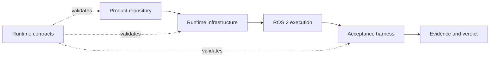

# Robotics Runtime Contracts

[](https://github.com/mmkolpakov/robotics-runtime-contracts/actions/workflows/ci.yml)
[](LICENSE)

Canonical, machine-verifiable contracts for portable robotics executions.

This package defines the boundary shared by product repositories, runtime
infrastructure, and acceptance tooling. It validates requested scenarios,
observed runtimes, evidence, qualification inputs, and verdicts. It does not
launch ROS 2, choose a simulator, collect telemetry, or contain product logic.

## Architecture



The contracts are neutral to robot type, simulator provider, scene, model
family, storage service, and transport implementation. Provider-specific facts
are recorded as data or namespaced extensions; they do not select a schema.

## Install

Python 3.12 or newer is required. Install a wheel from a tagged
[GitHub Release](https://github.com/mmkolpakov/robotics-runtime-contracts/releases),
or create a development environment:

```bash
uv sync --locked --all-groups
```

Release assets include build-provenance attestations. See
[SUPPLY_CHAIN.md](SUPPLY_CHAIN.md).

## CLI

Validate JSON or YAML using its declared `schema_version`:

```bash
robotics-contracts validate scenario.yaml
```

Resolve reviewed RFC 7396 overlays and retain their origin trace:

```bash
robotics-contracts scenario resolve base.yaml \
  --overlay camera.yaml \
  --overlay limits.yaml \
  --output resolved.yaml \
  --trace-output resolution-trace.json
```

Validate a complete, digest-linked qualification set:

```bash
robotics-contracts validate-qualification \
  --artifact scenario:scenario.json=scenario.json \
  --artifact acceptance_run:acceptance-run.json=run.json \
  --artifact runtime_manifest:runtime-manifests/main.json=runtime.json \
  --artifact domain_result:results/main.json=result.json \
  --artifact acceptance_aggregate:acceptance-aggregate.json=aggregate.json
```

Use `--quiet` for gates and `--format json` for stable machine-readable
diagnostics. `describe` reports a schema identifier and digest, `diff` emits an
RFC 7396 merge patch, and `permit init --subject-digest ...` creates an unsigned
physical-execution permit for an external signing workflow.

## Python API

```python
from robotics_runtime_contracts import (
    schema_for_role,
    schema_registry,
    validate_document,
    validate_role,
)

validate_document(document)
validate_role(document, "acceptance_scenario")
print(schema_for_role("runtime_manifest"))
registry = schema_registry()
```

Validation is offline, does not mutate inputs, rejects non-finite numbers, and
reports structural and semantic failures with an exact JSON path. The package
also exports `worst_status()` as the single status-folding rule shared by all
consumers.

## Contract Set

The repository currently publishes one canonical `v1` contract set. The
machine-readable source of truth is
[`catalog.v1.json`](src/robotics_runtime_contracts/schemas/catalog.v1.json).

| Area | Public roles |
| --- | --- |
| Execution | scenario, run, observation, result, aggregate, campaign |
| Runtime | runtime manifest, model manifest, dataset manifest |
| Evidence | evidence index, recording summary, artifact receipt |
| Qualification | profile, conformance result, bundle, policy |
| Physical safety | execution permit and verification |
| Cross-domain transport | channel, observation, clock relation, causal chain, qualification result |

Every public document uses JSON Schema Draft 2020-12, declares a
`schema_version` ending in `.v1`, rejects unknown root fields, and has an ID in
the `urn:robotics-runtime-contracts:v1:*` namespace. Internal schema resources
exist only to remove duplication and are not document roles.

## Extensions

Domain teams can add digest-pinned schemas without changing the common
contract. Extension keys use reverse-domain namespaces such as
`org.example.sorting`; schema bytes are supplied by the caller and are never
fetched from the network.

```python
validate_document(
    scenario,
    extension_schemas={
        "https://schemas.example.org/sorting.v1.schema.json": schema_bytes,
    },
)
```

Promote an extension into the common catalog only after it has reusable
semantics and evidence from more than one domain.

## Version Policy

There are no external consumers yet. Until package `1.0.0`, `main` carries one
canonical `v1` shape per role and does not retain compatibility readers for
superseded experiments. Released tags remain immutable and reproducible; a
breaking change to the active pre-1.0 contract set requires release notes and a
package minor version. See [COMPATIBILITY.md](COMPATIBILITY.md).

HIL and real-target contracts are observation-only. A valid document is not an
authorization to actuate hardware and is not proof that a device or accelerator
has been qualified.

## Development

```bash
uv sync --locked --all-groups
uv run pre-commit run --all-files --show-diff-on-failure
uv run pytest
uv build --no-sources
```

Consumer examples live in [`consumer-examples/`](consumer-examples/).
Contributions must follow [CONTRIBUTING.md](CONTRIBUTING.md), and security
reports must follow [SECURITY.md](SECURITY.md).

## License

[MIT](LICENSE)
